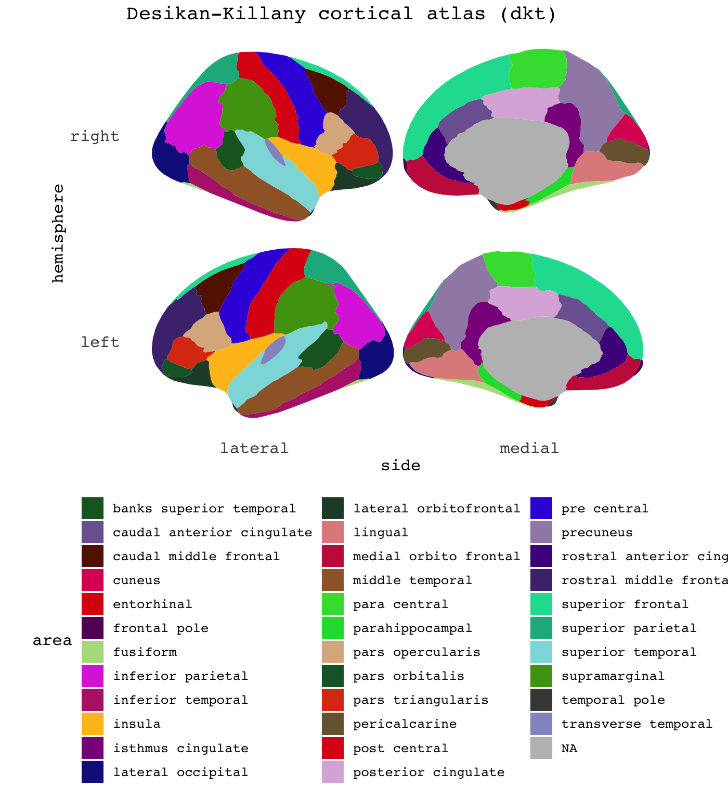
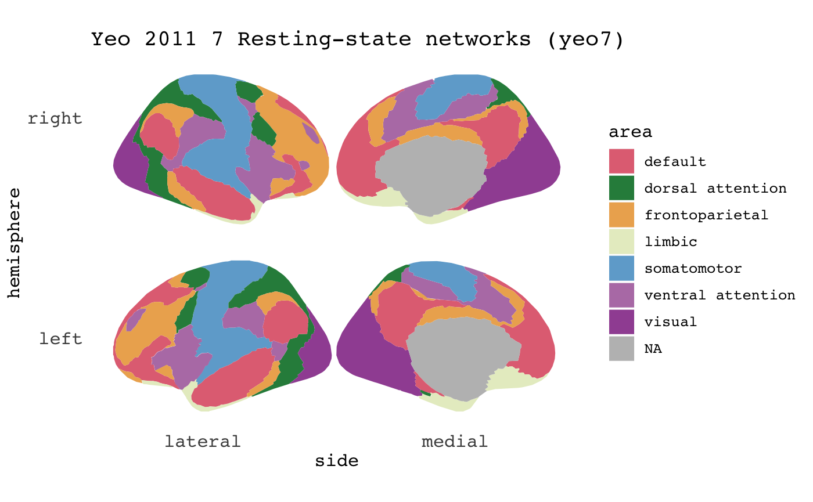
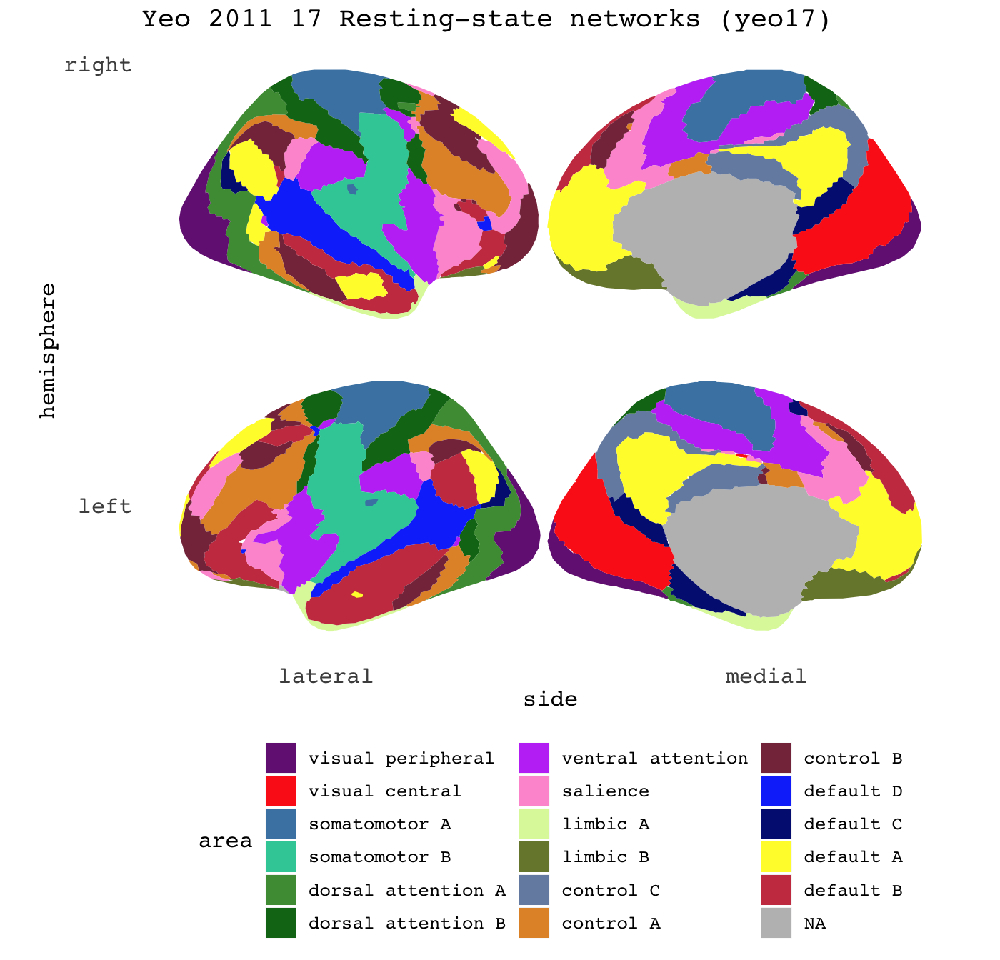
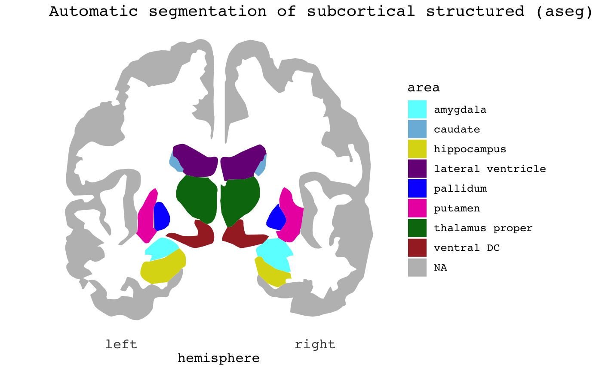

Plotting tool for brain atlases
================
Athanasia Mowinckel & Didac Vidal Pineiro

[](https://travis-ci.com/LCBC-UiO/ggseg)
[](https://ci.appveyor.com/project/LCBC-UiO/ggseg)
[](https://codecov.io/github/LCBC-UiO/ggseg?branch=master)

# ggseg 

This package mainly contains a plotting function `ggseg` and data.frames
of different brain atlases for plotting. Plotting results of analyses on
regions or networks often involves swapping between statistical tools,
like R and Matlab, and software for brain imaging to correctly visualise
analysis results.

This package aims to make it possible to plot results directly through
R.

## Atlases

There are currently four atlases available in the package:

1.  `dkt` - Desikan-Killany atlas (aparc).  
2.  `yeo7` - Yeo 2011 7 resting-state networks.  
3.  `yeo17` - Yeo 2011 17 resting-state network.  
4.  `aseg` - Automatic subcortical segmentation.

We are working on creating a detailed description in the wiki on how to
create and contribute atlases to the package. The `ggseg` function
already allows you to provide it with a data.frame of a custom atlas if
you have it, but is must correspond to certain specifications to work.

Please see the
[wiki](https://github.com/LCBC-UiO/ggseg/wiki/Creating-and-contributing-atlases)
for information on adding atlases, or inspect the included datasets for
requirements. If anything is unclear in the wiki, give us a shout out in
the issues\!

## Installation

The package can be installed using devtools. The package includes some
large datasets for the brain coordinates. Please be patient during
download and install, it will take some time.

``` r
install.packages("devtools")
devtools::install_github("LCBC-UiO/ggseg", build_vignettes = TRUE)
```

The functions are now installed, and you may load them when you want to
use them. All functions are documented in standard R fashion.

## Use

The package also has a vignette, to help you get started using it. You
can access it [here](https://lcbc-uio.github.io/ggseg/ggseg.html), or
via R:

``` r
library(ggseg)
vignette("ggseg")
```

You can also see one of the creators blog for introductions to its use
[here](https://drmowinckels.io/blog/introducing-the-ggseg-r-package-for-brain-segmentations/)

### Report bugs or requests

Don’t hesitate to ask for support using [github
issues](https://github.com/LCBC-UiO/ggseg/issues), or requesting new
atlases. While we would love getting help in creating new atlases, you
may also request atlases through the issues, and we will try to get to
it.

### Included atlases and palettes

<!-- -->

<!-- -->

<!-- -->

<!-- -->

# Funding

This tool is partly funded by:

**EU Horizon 2020 Grant:** Healthy minds 0-100 years: Optimising the use
of European brain imaging cohorts (Lifebrain).

**Grant agreement number:** 732592.

**Call:** Societal challenges: Health, demographic change and well-being
